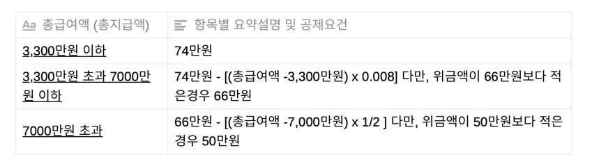
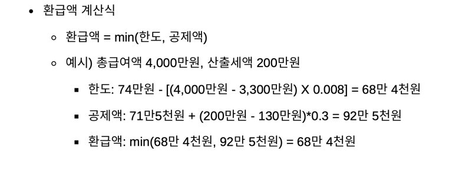

# 구현 목록

## 요구 사항

[x] Java11, Spring Boot2.6.4, JPA, H2, Gradle

[x] 프로젝트 character set은 UTF-8로 설정

[x] DB는 H2 Embeded DB를 사용

[x] swagger를 이용하여 API확인 및 API실행이 가능하도록 구현

[x] 민감정보(주민등록번호, 비밀번호 등)는 암호화 된 상태로 저장

##  Swagger 주소 

## 구현 여부

### 회원가입
    - 엔드 포인트 : /szs/signup
    - Method: POST
     data : {
        userId : String,
        password : String,
        name : String,
        name : String
    }
    요구 사항
    - password 는 암호화 하여 저장을 한다.
    - regNo 주민등록 번호도 암호화 하여 저장한다.
    - 5명의 고객만 회원가입을 할 수 없다.
        {
            홍길동, 860824-1655068
            김둘리, 921108-1582816
            마징가, 880601-2455116
            베지터, 910411-1656116
            손오공, 820326-2715702
        }

### 로그인
    - 엔드 포인트 : /szs/login
    - Method: POST
     data : {
        userId : String,
        password : String
    }
    요구 사항
    - 로그인이 성공하면 JWT 토큰을 통해 인가 / 인증
   

### 스크랩
    - 엔드 포인트 : /szs/scrap
    - Method: POST
     
    요구 사항
    - 로그인이이 되어있는 경우 본인 정보를 가져올 수 있다.
    - 스크랩 URL을 이용하여 데이터를 스크랩 할 수 있다.
    - API 요청 시간은 1~20 로 제한한다.
    - 다양한 오류가 발생 하기 때문에 Exception 관리해서 처리한다 

###  스크랩 정보로 유저 환급액 계산
    - 엔드 포인트 : /szs/refund
    - Method: GET
     
    요구 사항
    - 로그인이이 되어있는 경우 본인 정보를 가져올 수 있다.
   
   
## 구현 방법

## 검증 결과